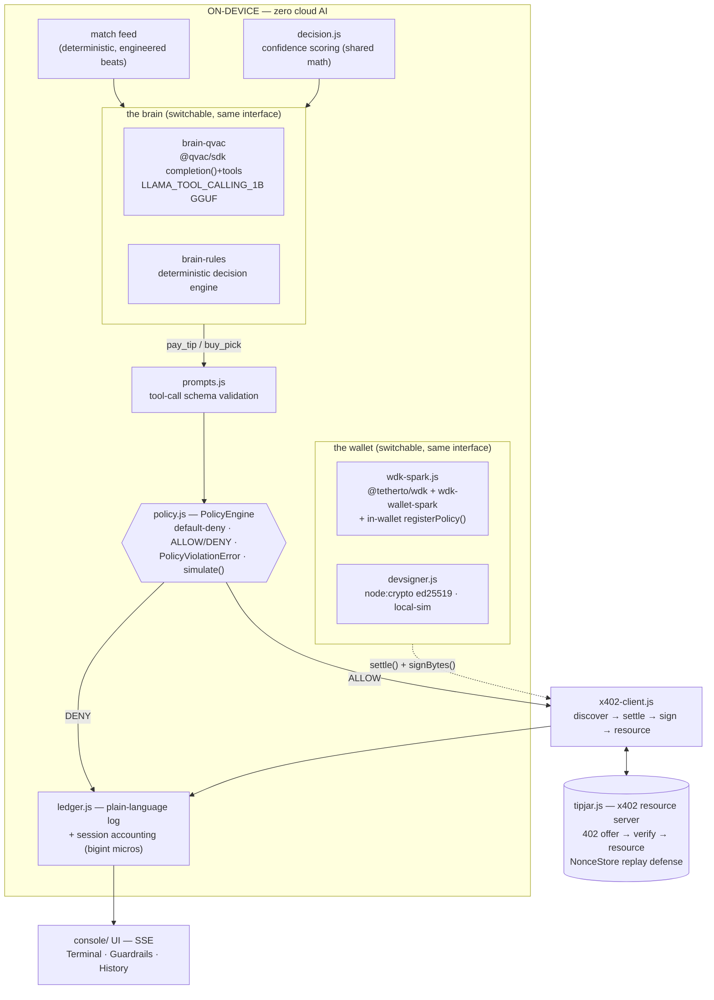

# Architecture — PunditPay (as built)

## System



## The x402 flow (as implemented in `src/core/x402.js`)

```
agent                                   tip jar
  │ GET /tip/@vantage?amount=0.15         │
  │ ◄──────────── 402 ────────────────────│  {x402Version:1, accepts:[{scheme:"exact",
  │                                       │    network, asset:"USDT", amount, payTo,
  │  wallet.settle(offer)                 │    resource, nonce, expiresAt}]}
  │  sign(canonical bytes)                │
  │ GET … [X-PAYMENT: base64(payload)] ──►│  nonce single-use? not expired? amount ≥ offer?
  │                                       │  network/asset/payTo/resource bound? signature ✓?
  │ ◄──────────── 200 ────────────────────│  resource + [X-PAYMENT-RESPONSE: receipt]
```

Canonical signing bytes = key-sorted JSON of the payload minus `signature` — tamper-evident by construction (`canonicalPaymentBytes`). Every binding (network, asset, recipient, resource, nonce, amount) is checked server-side in `verifyPayment`; nonces are single-use with TTL (`NonceStore`).

**Verification by mode** — the server never needs the payer's secrets:
- `local`: payload carries the raw ed25519 pubkey; server recomputes `address = pndt1‖sha256(pubkey)[0:20]` and verifies the signature (address↔key binding defeats impostors).
- `spark`: server builds `WalletAccountReadOnlySpark(payment.from)` and calls `verify(bytes, signature)` **and** `getTransactionReceipt(txHash)` — signature plus on-chain existence.

## Protocol invariants (tested, not asserted)

1. **Bounded autonomy** — `Σ session spend ≤ cap` before every signature; over-cap → `PolicyViolationError` (`test/policy.test.js`, `test/agent.e2e.test.js`).
2. **Default-deny** — any operation the model invents that no ALLOW rule addresses is refused (`no-applicable-rule`).
3. **Custody** — signing keys never serialize; the wire carries only signed payloads (adapters expose `signBytes`, never keys).
4. **Auditability** — every action is one plain-language ledger line; payments carry tx hashes; blocked attempts record `policyId`+`ruleName`+`reason`.
5. **No replay, no tamper, no impostor** — single-use nonces; canonical-bytes signatures; address↔pubkey binding (`test/tipjar.e2e.test.js` attacks section).
6. **On-device reasoning** — with fetch and raw sockets tripwired dead, all 9 decisions are still reached (`scripts/verify_offline.js`).

## Two-layer policy enforcement

The same limits exist twice on purpose:

| Layer | Where | What it stops |
|---|---|---|
| `PolicyEngine` (core) | pre-flight, before any settlement | malformed/hostile tool calls, over-cap, over-count, unknown recipients — testable offline |
| `wdk.registerPolicy` | **inside the WDK wallet** (spark mode) | anything that somehow reached the wallet: `sendTransaction` beyond the sats cap is refused at the signer |

WDK's engine is default-deny on governed accounts, so the wallet policy also explicitly ALLOWs `sign` (x402 payment signatures move no funds) — a real integration gotcha, documented in `docs/friction-log.md`.

## Model selection (measured, not guessed)

We ran the hero moment through three on-device candidates before choosing (details: `docs/friction-log.md` §8):

| Model | Size | tok/s (M-series GPU) | Tool-call quality |
|---|---|---|---|
| `QWEN3_600M_INST_Q4` | 0.4 GB | 213 | calls `pay_tip` with **empty arguments** |
| `LLAMA_TOOL_CALLING_1B_INST_Q4_K` | 0.8 GB | 196 | narrates the call in prose, no parseable call (even with `toolDialect:'pythonic'`) |
| **`QWEN3_1_7B_INST_Q4` (default)** | 1.1 GB | **142** | **correct structured calls** — full scripted match to the exact engineered outcome |

Football judgment comes from injected context + the deterministic confidence scores, not fine-tuning — reproducible on any machine. The `--model=` flag keeps all four wired. One integration fact worth knowing: tool definitions must carry top-level `type: 'function'` or QVAC's `validateTools()` treats them as Zod inputs and renders `parameters: {}` into the prompt (verified against SDK source; the model literally cannot see argument names without it).

## Residual risk (honest)

- Spark testnet + `@tetherto/wdk@beta` — pinned versions; the default demo path has zero dependence on testnet uptime.
- The demo's creators run one tip jar; open discovery of arbitrary x402 vendors (and their trustworthiness) is out of scope.
- The agent's judgment is heuristic; the cap bounds the blast radius — that trade is the product's thesis, stated openly.
