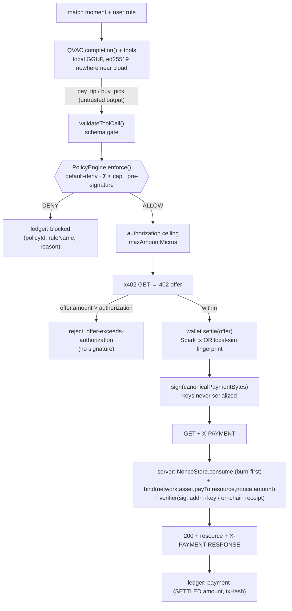

# Complexity Blueprint: PunditPay (as built)

The 5-layer complexity gauntlet, documented against the shipped code — not aspirational.

## 1. High-complexity data pipeline

## 2. Cryptographic schema

- **Payment envelope:** flat JSON `{ x402Version, scheme, network, asset, amount, payTo, resource, nonce, from, txHash, settledAt, fromPublicKey? }`. Signed over **canonical bytes** = key-sorted JSON minus `signature` (`src/core/x402.js` `canonicalPaymentBytes`) — tamper-evident by construction; any field change breaks the signature.
- **Signature:** ed25519 (local mode, `node:crypto`) or Spark identity signing (`account.sign`). Verified without the payer's secrets.
- **Address binding:** `address = "pndt1" ‖ hex(sha256(pubkey)[0:20])` (`src/wallet/devsigner.js` `deriveAddress`). The server recomputes it from the payload's public key → impostor keys fail the binding before signature check.
- **Replay defense:** single-use nonces with TTL, burned **synchronously before** async verification (`NonceStore.consume`) — proven race-free under a 10× concurrent-burst test.
- **Spark verification:** `WalletAccountReadOnlySpark(from).verify(bytes, sig)` **and** `getTransactionReceipt(txHash)` — signature plus on-chain existence.

## 3. Economic engine (x402 + two-layer policy)

- **Pay-per-tip / pay-per-pick over HTTP 402** — the offer advertises `{scheme:'exact', amount, payTo, nonce, expiresAt}`; payment is the credential; no accounts.
- **Bounded autonomy, enforced twice:**
  1. `PolicyEngine` (pre-flight, `src/core/policy.js`) — default-deny; rules: `within-session-cap`, `block-over-cap`, `block-over-per-tip-max`, `block-over-tip-count`, pick budget, allowlist, `block-malformed-amount`.
  2. `wdk.registerPolicy(buildWdkPolicy(...))` — the same cap **inside the WDK wallet**; an over-cap `sendTransaction` is refused at the signer.
- **Invariant:** `Σ settled spend ≤ session cap` holds because settled ≤ authorized ≤ (cap − prior spend), verified pre-signature and re-checked by `agent.e2e` + `policy` suites.

## 4. Developer packaging

- **CLI:** `bin/punditpay.js` — `server | agent | demo`, flags `--brain`, `--wallet`, `--model`, `--pace`, `--console`.
- **Reusable core:** `src/core/{x402,policy,money,decision,ledger,prompts}.js` are pure, import-able modules.
- **Agent Skill:** `SKILL.md` (AgentSkills / MCP-shaped tool schemas) — drops into any agent.
- **Wallet adapter interface:** `{ getAddress, publicKeyB64, signBytes, settle, getBalance, dispose }` — Spark and local dev signer are interchangeable.

## 5. Verification & performance proofs

- **`scripts/bench.js`** — p50/p95 for decision (µs), x402 round-trip (ms), full pipeline (ms); writes `bench-results.json`; CI enforces a p95 budget.
- **`scripts/verify_offline.js`** — kills `fetch` + raw sockets, proves all 9 decisions still reached with zero network attempts, then shows settlement failing cleanly offline.
- **`scripts/check_submission_readiness.js`** — cross-checks the README test count against `npm test` reality; fails on placeholders / wrong license.
- **Seed data:** `src/core/matchfeed.js` — a deterministic scripted match engineered around the hero beat (90+2' winner, 96% confidence) and the guardrail beat (FT over-cap block).
- **268 tests / 62 suites**, **100% line + 100% function + 100% branch coverage on `src/`** (CI-gated via `npm run coverage`; live QVAC/Spark calls `node:coverage`-disabled with reasons, `bin/` CLI excluded as bootstrap), incl. an adversarial hostile-brain suite and a self-audit regression set.

## Mainnet / production credibility (honest)

Settlement targets Spark **TESTNET** (rules permit testnet; a tipping demo needs no mainnet risk). The default demo is zero-dependency on external uptime via `--wallet=local` (real ed25519, honestly-labeled `local-sim`). Real on-chain proof needs faucet + Spark testnet access — an explicit human step in `PROGRESS.md`, never claimed as done.
