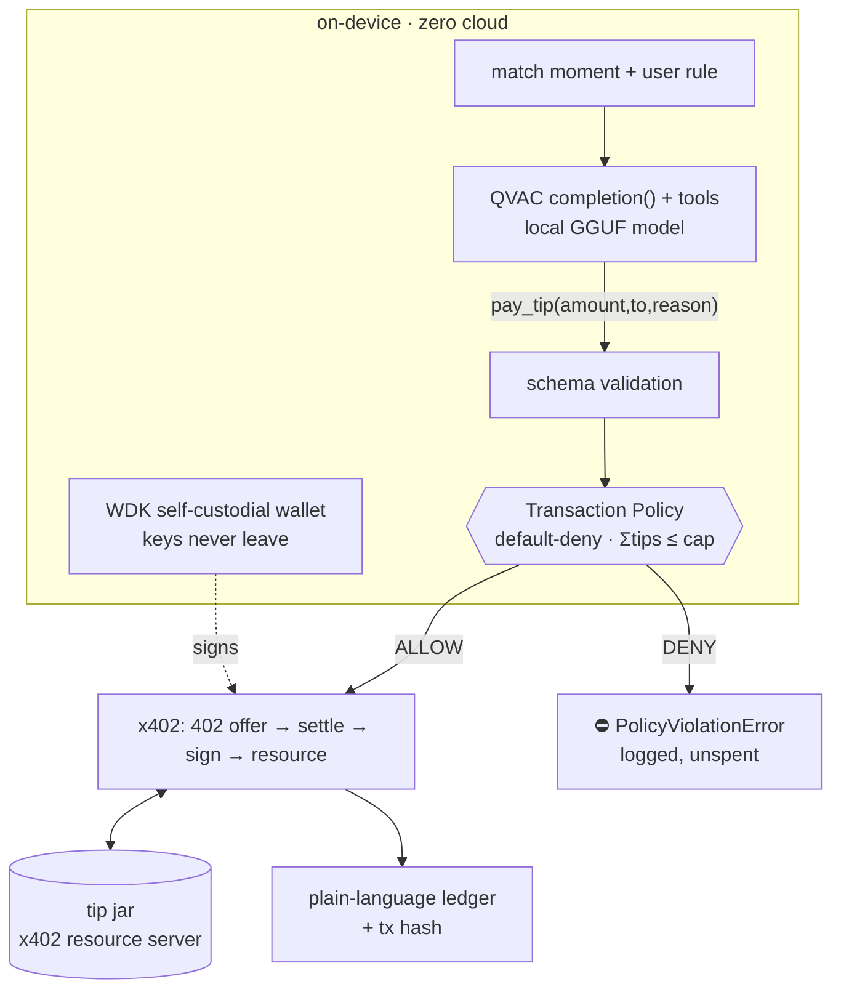

<div align="center">
  
  <h1>PunditPay ⚽💵</h1>
  <p><em>The on-device AI agent that rewards great football commentary with its own money — and can prove it never overspends.</em></p>
  

  <br/>

  [](https://youtu.be/cMbJLGaXcdQ)
  [](https://edycutjong.github.io/punditpay/landing)
  [](https://edycutjong.github.io/punditpay/docs/pitch)

  [](https://dorahacks.io/hackathon/tether-developers-cup)
  

  <br/>

  
  
  
  
  
  
  
  [](https://github.com/edycutjong/punditpay/actions/workflows/ci.yml)
</div>

---

*I wanted to tip the streamer who called the stoppage-time comeback — but it meant an account, a card, a checkout, and handing my data to a payment processor. The moment passed. I never tipped.*

**PunditPay** is a fully-local agent that holds its own keys and pays over plain HTTP. It reasons about the match **on your device** with QVAC, and when your rule says a moment earned it ("tip only above 70% confidence"), it signs a **USD₮ tip via x402** — one round-trip, no account, no card, no API key. A WDK **Transaction Policy** makes the autonomy bounded: over the cap, the wallet itself refuses with `PolicyViolationError`, live, in red.

**Tipping and pay-per-pick appreciation — never wagering.** There is no house, no odds, and no stake in any outcome.

## 📸 One demo run, every beat

```
$ npm run demo
🧠 minute 92': ASTORA 3–2 IN STOPPAGE TIME — the exact counter @vantage booked at 74'
🧠   +30 called-it (called it at 74')  +10 call-lead  +12 track-record …
🧠   ⇒ confidence 96% vs rule >70%
✅ Tipped 0.25 USD₮ to @vantage — called the stoppage-time counter · tx sim-bb6c…6817
·  FT — Astora 3–2. The user impulse: “send him one more.”
🧠   ⇒ confidence 84% vs rule >70% · cap check: 1.00 spent of 1.00
⛔ BLOCKED — PolicyViolationError: would exceed session cap (attempted 0.25 USD₮ to @vantage)
✔ done — 4 tips, 1 pick, 1.00 USD₮ spent, 1 blocked, 3 declined
```

A browser console at `http://127.0.0.1:4020` streams the same session live: the reasoning terminal, the x402 handshake card, the amber spend-cap meter, and the action log — all served locally, zero external requests.

## 🚀 Getting started (out of the box)

```bash
git clone https://github.com/edycutjong/punditpay.git && cd punditpay
npm install
npm run demo          # scripted match · deterministic brain · local-sim settlement · console UI
```

That's it — the default demo needs **no keys, no faucet, no model download** and finishes in ~2 minutes. Then go deeper, one flag at a time:

```bash
npm run demo -- --brain=qvac     # REAL on-device LLM decides (downloads a ~1.1 GB GGUF once, then fully local)
npm run keygen                    # → PUNDITPAY_SEED_PHRASE / TIPJAR_SEED_PHRASE in .env
npm run demo -- --wallet=spark   # REAL Spark testnet settlement (zero-fee sats, explorer links)
npm run server                    # run the x402 tip jar alone;  curl -i http://127.0.0.1:4021/tip/@vantage
```

> **Live-verified:** with `--brain=qvac` the real model (`QWEN3_1_7B_INST_Q4`, 142 tok/s on an M-series GPU) played the whole scripted match — in our verified run to the exact engineered outcome (4 tips + 1 pick = 1.00 USD₮, the 90+2' hero tip with the model's own generated reason, the FT attempt blocked by `PolicyViolationError`). The model's judgment varies run to run — that's a real LLM deciding — but the guarantees hold on **every** run: Σ spend ≤ cap, every payment policy-gated pre-signature, every decision logged in plain language. (`--brain=rules` reproduces the exact script deterministically.)

| Mode | What's real | What to know |
|---|---|---|
| `--brain=rules` *(default)* | deterministic decision engine — same confidence math the LLM is grounded on | reproducible; what tests/CI run |
| `--brain=qvac` | **a real GGUF model** (`QWEN3_1_7B_INST_Q4` default) deciding via QVAC tool-calling, 100% on-device | first run downloads the model to the local cache; `--model=` swaps sizes |
| `--wallet=local` *(default)* | real ed25519 keys + signatures (node:crypto); settlement is an honest `local-sim` fingerprint | zero setup |
| `--wallet=spark` | **real Spark transfers** via `@tetherto/wdk-wallet-spark` — zero-fee, self-custodial, explorer links | needs 2 seed phrases + testnet sats; USD₮→sats demo rate 1:1000 disclosed; see TESTNET endpoint note in [limitations](#%EF%B8%8F-honest-limitations) |

## 🧠 How it works — one loop, extreme depth



The model proposes; the policy disposes. Every payment passes **two** policy layers — the core engine pre-flight, and (in spark mode) the same limits registered inside the WDK wallet via `wdk.registerPolicy()`, so an over-cap signature is refused by the wallet itself.

## 🏗️ What's in the box

```
bin/punditpay.js     CLI: server | agent | demo
src/core/            x402 protocol · policy engine · decision math · ledger · match feed  (pure, no I/O)
src/agent/           QVAC brain · deterministic brain · x402 client · orchestrator
src/wallet/          WDK Spark adapter · ed25519 dev signer
src/server/          x402 tip jar · console SSE server
console/             live agent console (3 screens, self-contained HTML)
landing/             one-page explainer
scripts/             bench · verify_offline · check_submission_readiness · keygen · lint · demo
test/                268 tests (node:test), all green
docs/                AUDIT_REPORT · SELF_REVIEW · friction-log · PITCH_DECK
SPONSOR_DEFENSE.md · COMPLEXITY.md · SKILL.md · DEMO.md · ARCHITECTURE.md
```

## 🏆 Why ONLY QVAC + WDK

**QVAC** (the brain): `loadModel()` GGUF → `completion()` with **tool-calling** — the model, not a button, decides to call `pay_tip`; streaming reasoning via `tokenStream`; `toolCallStream` for structured calls; on-device inference so judgment and history never leave the machine; model constants (`LLAMA_TOOL_CALLING_1B_INST_Q4_K`) make setup one line.

**WDK** (the hands): self-custodial **BIP-39 keys on-device** (`@tetherto/wdk`); **Transaction Policies** — a default-deny ALLOW/DENY engine with `PolicyViolationError` and `simulate()` (bounded autonomy *in the wallet*, not in a server you trust); **`wdk-wallet-spark`** zero-fee transfers that make $0.05 tips economical; `sign`/`verify` powering the x402 payment envelope; `getRandomSeedPhrase()`/`isValidSeed` for key generation.

**x402** (the handshake): HTTP 402 → signed payment → resource, one paid round-trip. No accounts on either side — the payment *is* the credential.

**Take QVAC + WDK out** and this needs: a cloud LLM + API key, a payment processor, an account system, a checkout UI, a custodial wallet, and a server-side limits engine — six systems and a data-sharing agreement — to do what one on-device agent does in a single HTTP round-trip.

## 🧪 Tests & proofs — claims you can re-run

**268 tests** (node:test), 62 suites, all passing in <1 s; **100% line + 100% function + 100% branch coverage on `src/`**, enforced by a CI gate (`npm run coverage`). The only code *not* measured is honestly labelled: the live QVAC model calls (`loadModel`/`completion` — need a ~1GB GGUF) and the Spark testnet wallet (`@tetherto/wdk` — needs funds) are `node:coverage`-disabled with one-line reasons and proven by the manual `--brain=qvac` / `--wallet=spark` runs; the CLI entrypoint (`bin/`) is excluded from the gate as pure process-bootstrap, exercised instead by the real-subprocess CLI suite + the CI smoke run. Coverage spans every protocol invariant: x402 offer/payment/receipt round-trips, replay + tamper + impostor + authorization-overrun rejection, policy default-deny + cap math + count rails, pick determinism, ledger accounting, hostile-brain containment, and the full agent-vs-tipjar session over real HTTP.

```bash
npm test                  # 268/268
npm run lint              # syntax + framing guard (betting vocab = failure) + zero-cloud guard
npm run bench             # reproducible p50/p95
npm run verify:offline    # kills fetch + sockets, then proves reasoning still works
```

Benchmarks on an Apple-silicon laptop (node 22, `npm run bench`, N=200 payments — representative run, re-run for your numbers):

| Path | p50 | p95 |
|---|---|---|
| confidence decision (`evaluateMoment`) | ≈0.4 µs | ≈0.8 µs |
| x402 discover (402 + offer) | ≈0.3 ms | ≈0.6 ms |
| x402 settle + sign + paid retry | ≈0.5 ms | ≈1.2 ms |
| **moment → policy → settled tip (full pipeline)** | **≈0.9 ms** | **≈3 ms** |

`BENCH_QVAC=1 npm run bench` adds real on-device tokens/sec for the LLM path.

## ⚠️ Honest limitations

- **Testnet + beta**: Spark settlement targets **TESTNET**; `@tetherto/wdk` is `1.0.0-beta.12` (pinned). In our live test, key derivation worked but the current `js-spark-sdk` build resolved TESTNET operator auth to a local ingress (`::1:8536`) — reaching Spark's public testnet may need newer SDK endpoint config or provisioned access (details in [docs/friction-log.md](docs/friction-log.md)). The npm `wdk-mcp-toolkit` package is a placeholder today, so the Agent Skill ships as [`SKILL.md`](SKILL.md) rather than an MCP dependency.
- **Default demo simulates settlement**: `--wallet=local` signs real ed25519 payments but the "chain" is an honestly-labeled `local-sim` fingerprint. On-chain proof requires `--wallet=spark` + testnet sats.
- **Heuristic judgment**: the agent tips on plausible reasoning, not verified match truth — that's exactly why the hard cap exists.
- **Known endpoint**: the demo pays a known tip jar; open vendor discovery is out of scope.
- **USD₮ denomination**: Spark transfers move sats; tips are USD₮-denominated at a fixed disclosed demo rate (1 USD₮ = 1,000 sats).

## 📜 Prior work — disclosed

The QVAC×WDK pattern (local agent → Lightning/Spark settlement) is proven by Tether's own [`qvac-coffee-conversation`](https://github.com/tetherto/qvac-examples) example, which gave us the confidence to pick this stack. **PunditPay's code is written from scratch for this event** — the only runtime dependencies are the three Tether SDKs. The x402 flow follows the open [x402 spec](https://www.x402.org/) (402 offer → `X-PAYMENT` → `X-PAYMENT-RESPONSE`), implemented natively in `src/core/x402.js`.

## 📄 License

[Apache-2.0](LICENSE) © 2026 Edy Cu — built for the Tether Developers Cup. Thank you to the Tether team for QVAC, WDK, and the kind of SDKs that make an agent with its own wallet a weekend reality instead of a keynote slide.
